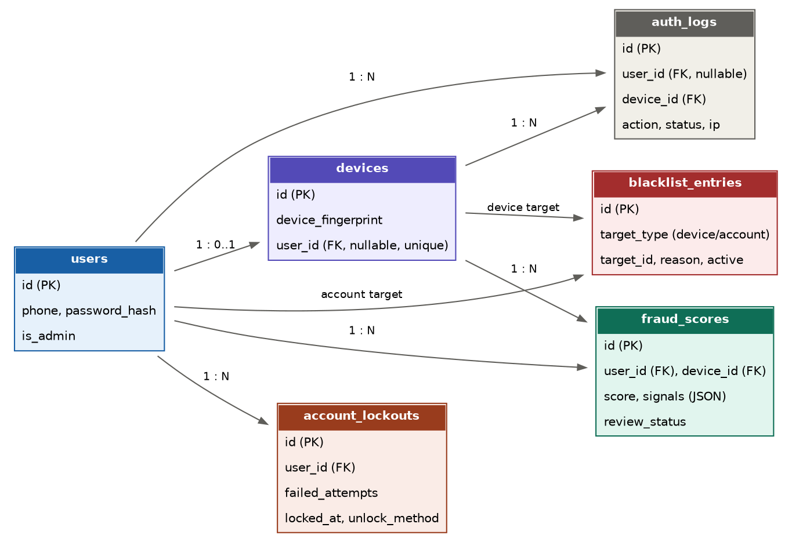
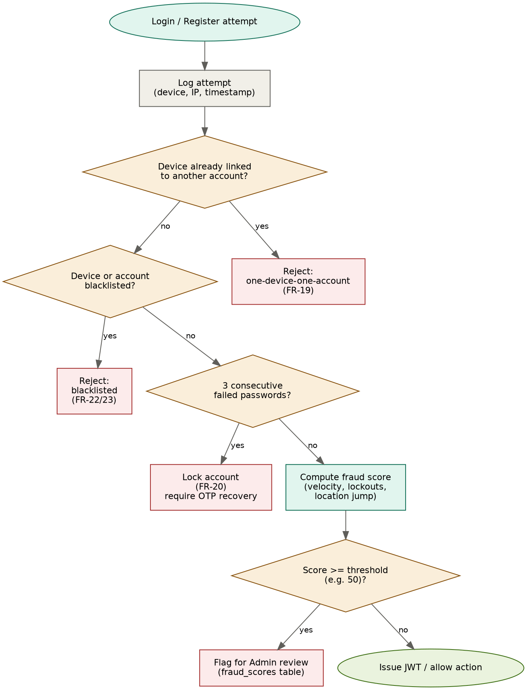

# Fraud Detection & Device Security — Design Document

**Project:** [HomeServe](https://github.com/csesaidul/home_serve)
**Author:** [Saidul Islam](https://github.com/csesaidul/)
**Date:** 19-Aug-2026
**Status:** Draft — companion to `requirement.md` v1.3 (FR-18 to FR-24)

---

## 1. Purpose

This document specifies the design for the device-security and fraud-detection
features referenced in the requirements document: device logging, one-account-per-device
enforcement, failed-login lockout with OTP recovery, device/account blacklisting, and
a rule-based fraud scoring system. It is meant to be detailed enough to implement
directly against the FastAPI + MySQL stack.

---

## 2. Scope

In scope:

- Logging every registration/login attempt (success and failure)
- Enforcing at most one account per device
- Locking an account after 3 consecutive failed password attempts, with OTP-based recovery
- Admin-managed device and account blacklists
- A rule-based (non-ML) fraud score computed from login/device signals, queued for Admin review

Out of scope (for MVP):

- Machine-learning based fraud detection
- IP-geolocation database integration (a placeholder/stub is assumed)
- Device fingerprinting library selection (assumed to be handled client-side in Flutter;
  this document treats `device_fingerprint` as an opaque string produced by the app)

---

## 3. Data Model

Five new tables support this feature, alongside the existing `users` table.



### 3.1 `devices`

| Field | Type | Notes |
|---|---|---|
| id | PK | |
| device_fingerprint | string, unique | Generated client-side (Flutter) |
| user_id | FK → users, nullable, **unique** | Enforces one account per device (FR-19) |
| device_type | string | e.g. android, web |
| os | string | |
| first_seen_at | timestamp | |
| last_seen_at | timestamp | |

A device row's `user_id` becomes non-null the first time that device successfully
registers or logs into an account. Any subsequent registration or login attempt from
the same `device_fingerprint` for a **different** `user_id` is rejected (FR-19).

### 3.2 `auth_logs`

| Field | Type | Notes |
|---|---|---|
| id | PK | |
| user_id | FK → users, nullable | Null when the attempt fails before a user is resolved (e.g. unknown phone) |
| device_id | FK → devices | |
| ip_address | string | |
| action | enum | register / login / otp_login / password_reset |
| status | enum | success / fail |
| failure_reason | string, nullable | e.g. wrong_password, device_blacklisted, account_locked |
| created_at | timestamp | |

Immutable, append-only. This table is the primary input to the fraud scoring job (Section 5).

### 3.3 `account_lockouts`

| Field | Type | Notes |
|---|---|---|
| id | PK | |
| user_id | FK → users | |
| failed_attempts | int | Reset to 0 on successful login or unlock |
| locked_at | timestamp, nullable | |
| unlocked_at | timestamp, nullable | |
| unlock_method | string, nullable | e.g. otp_reset |

### 3.4 `blacklist_entries`

| Field | Type | Notes |
|---|---|---|
| id | PK | |
| target_type | enum | device / account |
| target_id | int | References `devices.id` or `users.id` depending on `target_type` |
| reason | text | |
| blacklisted_by | FK → users (admin) | |
| blacklisted_at | timestamp | |
| active | boolean | Soft-disable without deleting history |

### 3.5 `fraud_scores`

| Field | Type | Notes |
|---|---|---|
| id | PK | |
| user_id | FK → users | |
| device_id | FK → devices | |
| score | int | |
| signals | JSON | Open-ended, e.g. `{"device_already_linked_other_account": true, ...}` |
| computed_at | timestamp | |
| reviewed_by | FK → users (admin), nullable | |
| review_status | enum | pending / cleared / actioned |

---

## 4. Authentication Flow with Security Checks

Every login or registration attempt passes through the same gate before a JWT is issued.



**Order of checks (fail-fast, cheapest/highest-confidence first):**

1. **Log the attempt** into `auth_logs` immediately (before any pass/fail decision), so
   even rejected attempts are auditable (FR-18).
2. **Device-account binding check** (FR-19): if the device is already linked to a
   different `user_id`, reject with `device_already_linked`.
3. **Blacklist check** (FR-22/FR-23): if the device or the resolved account is on
   `blacklist_entries` with `active = true`, reject with `blacklisted`.
4. **Lockout check** (FR-20): if `account_lockouts.locked_at` is set and not yet
   unlocked, reject password-based login with `account_locked` — OTP login/reset is
   still allowed so the user can recover.
5. **Fraud score** (FR-24): computed asynchronously/inline (see Section 5) after a
   successful auth step; does not block login by itself, only queues for review.
6. **Issue JWT** if all checks pass.

Steps 2–4 are hard gates enforced server-side on every request, not just at login time,
since capability claims should not be trusted from a device that later gets blacklisted
mid-session — session invalidation on blacklist is a follow-up detail to confirm with
the team.

---

## 5. Fraud Scoring Algorithm

A simple weighted rule-based score, deliberately not ML-based given the team size and
timeline. Weights and threshold are config values, not hardcoded, so they can be tuned
against real demo data.

```python
WEIGHTS = {
    "device_already_linked_other_account": 40,   # FR-19 violation attempt
    "registration_velocity_same_ip":       25,   # 3+ registrations in 5 min from 1 device/IP
    "recent_lockout_count":                15,   # per lockout in the last 24h, capped
    "impossible_location_jump":            30,   # implausible speed vs. last successful login
    "blacklisted_ip_range":                20,   # known VPN/proxy/abuse range
}

THRESHOLD = 50

def compute_fraud_score(user_id, device_id):
    signals = {}
    score = 0

    if device_linked_to_other_account(device_id, exclude=user_id):
        signals["device_already_linked_other_account"] = True
        score += WEIGHTS["device_already_linked_other_account"]

    recent_count = count_recent_attempts(device_id, window_minutes=5)
    if recent_count >= 3:
        signals["registration_velocity_same_ip"] = recent_count
        score += WEIGHTS["registration_velocity_same_ip"]

    lockouts_24h = count_lockouts(user_id, hours=24)
    if lockouts_24h > 0:
        signals["recent_lockout_count"] = lockouts_24h
        score += WEIGHTS["recent_lockout_count"] * min(lockouts_24h, 2)

    prev = get_last_successful_login(user_id)
    curr = get_current_location(user_id)
    if prev and is_impossible_travel(prev, curr):
        signals["impossible_location_jump"] = True
        score += WEIGHTS["impossible_location_jump"]

    if is_blacklisted_ip(get_ip(device_id)):
        signals["blacklisted_ip_range"] = True
        score += WEIGHTS["blacklisted_ip_range"]

    save_fraud_score(user_id, device_id, score, signals)

    if score >= THRESHOLD:
        queue_for_admin_review(user_id, device_id, score, signals)
        return "flagged"
    return "clear"
```

**Design notes:**

- **Caps on repeatable signals** (e.g. `min(lockouts_24h, 2)`) prevent a forgetful but
  legitimate user from getting flagged purely for repeated password mistakes.
- `is_impossible_travel` can start simple: `distance_km / hours_elapsed > 900`
  (faster than a commercial flight implies the two logins can't both be genuine).
- Hard gates (device reuse, blacklist) already block the request synchronously at
  steps 2–3 above; the remaining signals (velocity, lockouts, location) can run
  asynchronously after the response is sent, so the 2-second API SLA (NFR 2.1) isn't
  affected by fraud scoring.
- The score is advisory, not auto-blocking, except where a signal is already a hard
  gate elsewhere — this avoids false positives locking out real users.

---

## 6. Failed-Login Lockout & Recovery (FR-20 / FR-21)

1. Each failed password attempt increments `account_lockouts.failed_attempts` for
   that user.
2. On the 3rd consecutive failure, `locked_at` is set and password login is rejected
   for that account until unlocked.
3. A successful password login at any point before lockout resets
   `failed_attempts` to 0.
4. Recovery path (the only way out of a lock):
   - User taps **Forgot Password**
   - OTP sent via AWS SNS to the registered phone
   - OTP verified
   - User sets a new password
   - `unlocked_at` and `unlock_method = otp_reset` are recorded, `failed_attempts`
     resets to 0

---

## 7. Admin Actions

- **Blacklist a device or account** — creates a `blacklist_entries` row; takes effect
  immediately on the next auth check.
- **Review fraud queue** — Admin sees `fraud_scores` rows with `review_status = pending`,
  ordered by score descending, and can mark `cleared` or `actioned` (which may itself
  trigger a blacklist entry).

These map to UC-13 in `requirement.md`.

---

## 8. Open Questions

- Should a mid-session blacklist immediately revoke an issued JWT, or only block the
  *next* login? (Affects whether blacklist checks need to run on every API call or
  only at auth time.)
- What IP-range/VPN blacklist source will be used for `is_blacklisted_ip` — a static
  list is sufficient for the MVP demo.
- Should `THRESHOLD` differ by action type (e.g. stricter for registration than login)?
